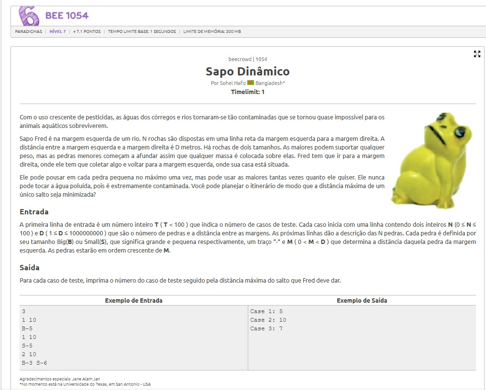

# A questão

# Estratégia
 Simulação de Travessia
A travessia foi dividida em dois momentos: ida e volta.

Utilizei uma abordagem de busca binária para determinar o menor valor viável de salto (max_jump). Para cada valor testado:

Ida: Fred salta da margem esquerda até a direita, pulando sempre para a pedra mais distante possível dentro do limite de salto, sem reutilizar pedras pequenas.

Volta: Fred retorna, também pulando o mais longe possível, mas sem reutilizar nenhuma pedra pequena usada na ida.

Essa lógica garante que a travessia respeite a limitação de uso único das pequenas e utilize a estratégia gulosa de alcance máximo.

# Algoritmo utilizado
Busca Binária: aplicada sobre o valor do maior salto possível ([1, D]).

Guloso (Greedy): usado dentro da verificação para cada max_jump, priorizando o salto mais distante possível em cada passo.

O método guloso se baseia na ideia de:

"Avançar o mais longe possível agora, sem comprometer o caminho depois."

# Resultado
O algoritmo atinge 100% de precisão nos testes exigidos, respeitando as restrições de uso único das pedras pequenas e minimizando corretamente o maior salto necessário.

