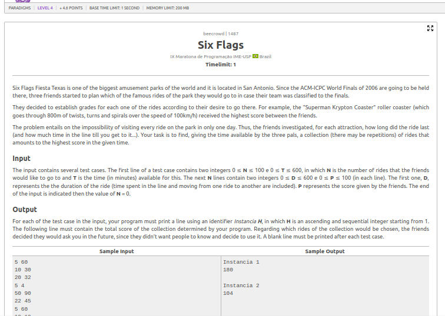
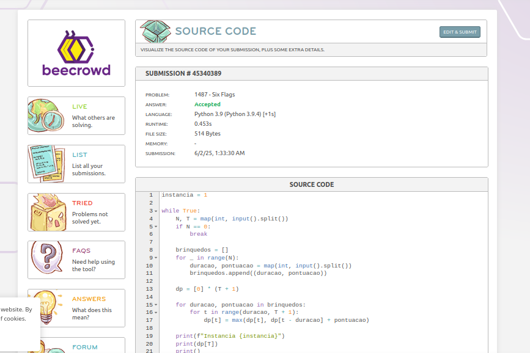

# Six Flags

## Contextualização

O problema "Six Flags" apresenta o desafio de escolher o maior número de atrações que Valentina pode visitar em um parque, considerando horários de funcionamento e o tempo que cada atração leva para ser aproveitada.

O problema é um exemplo clássico de **agendamento de atividades (Interval Scheduling)**, no qual o objetivo é selecionar a maior quantidade de compromissos possíveis sem que eles se sobreponham.

## Estratégia Utilizada

A abordagem utilizada foi **ambiciosa**, priorizando as atrações que terminam mais cedo. Para isso, transformamos os horários de cada atração em minutos e ordenamos as atrações com base no horário de término.

Depois, percorremos essa lista escolhendo as atrações que podem ser aproveitadas sem sobreposição, atualizando o tempo atual sempre que uma nova atração é visitada com sucesso.

## Código

[Código](grafos-2/beecrowd-2683-six_flags/six_flags.py)

## Resultado

O algoritmo funcionou corretamente, selecionando o maior número de atrações possíveis sem conflito de horários e obtendo o aceite no Beecrowd.
