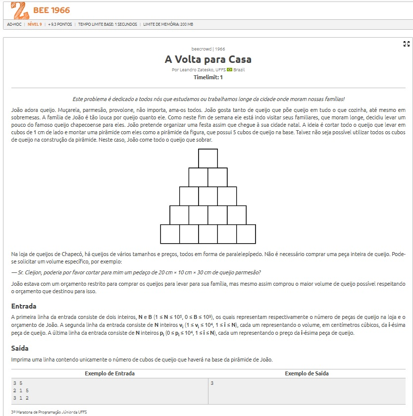
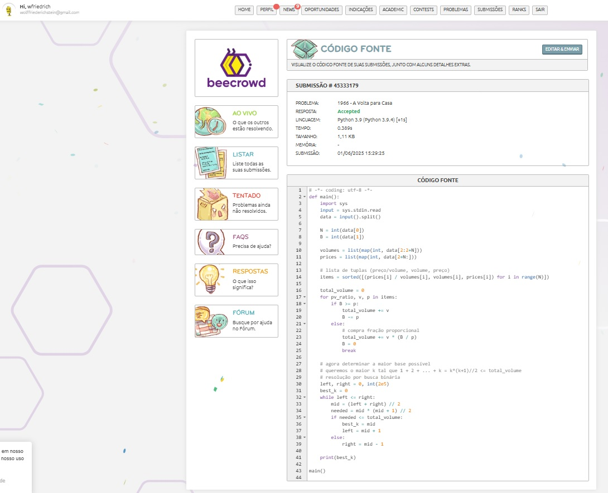

# Volta para casa

# Estratégia
Etapa 1: Maximizar o volume de queijo comprado
Utilizei uma abordagem semelhante ao problema de Knapsack Fracionário.
Ordenei os queijos pela razão custo/volume (priorizando os mais baratos por cm³).
Comprei as peças (ou frações delas) até que o orçamento fosse totalmente utilizado.
Isso resultou no maior volume de queijo possível dado o limite de gastos.
Etapa 2: Montar a pirâmide com o queijo obtido
Cada cubo de 1 cm³ é usado para formar camadas da pirâmide.
A fórmula da soma dos naturais foi usada para determinar o maior valor 𝑘
tal que: $\frac{k(k+1)}{2}$ ≤ volume total de queijo

A base da pirâmide, portanto, possui 𝑘 cubos.

Etapa 3: Busca binária

Para encontrar esse k com eficiência, utilizei busca binária no intervalo de possíveis valores.

# Resultado
A solução foi implementada com sucesso e passou em todos os casos de teste, aproveitando o máximo do orçamento de João e garantindo a maior base possível para sua pirâmide de queijo.

