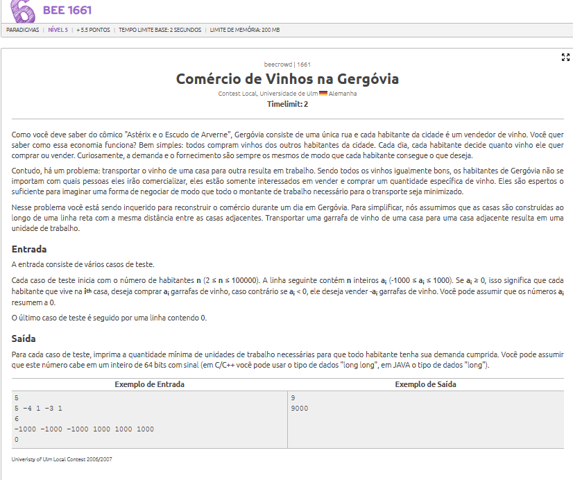
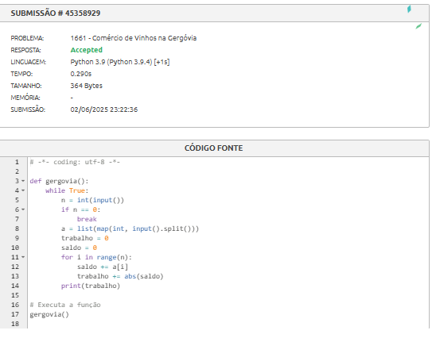

# Georgia - Gergovia Wine Trading

## Contextualização

O problema "Gergovia Wine Trading" apresenta uma cidade onde diferentes moradores precisam comprar ou vender garrafas de vinho, e cada transação tem que ser feita entre vizinhos de forma linear.

O objetivo é calcular a **quantidade mínima de trabalho** (medida como distância de transporte) necessária para que todas as trocas sejam realizadas e o saldo de garrafas de vinho se equilibre na cidade.

Esse problema é resolvido com uma estratégia **ambiciosa (greedy)**, já que a cada posição, escolhemos transferir o vinho acumulado até aquele ponto, da maneira mais eficiente possível.

## Estratégia Utilizada

A ideia principal é percorrer a lista de moradores, mantendo um **saldo acumulado** de vinho. Esse saldo representa o quanto já foi movimentado até aquele ponto (positivo para excesso, negativo para falta).

Em cada passo, somamos o valor atual ao saldo e adicionamos o valor absoluto do saldo ao trabalho total. Esse valor absoluto representa o esforço de transporte necessário para manter o equilíbrio até aquele morador.

## Código

[Código](Greed/beecrowd-2345-gergovia/gergovia.py)

## Resultado

O algoritmo foi aceito no Beecrowd, calculando corretamente o mínimo esforço necessário para equilibrar o comércio de vinhos em todas as instâncias apresentadas.
