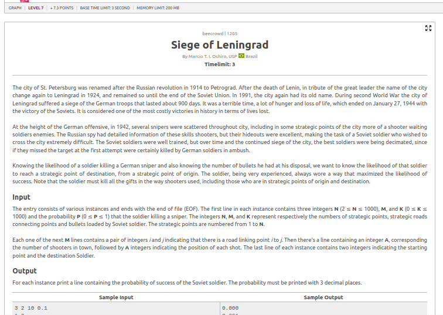

# Siege of Leningrad

## Contextualização

O problema "Siege of Leningrad" propõe uma situação em que Valentina precisa atravessar uma cidade sitiada representada por uma matriz N×N, coletando o máximo de recursos possíveis. Ela pode iniciar em qualquer célula da primeira linha e deve chegar até a última linha, se movendo apenas para a linha seguinte em três direções possíveis: diagonal esquerda, em frente ou diagonal direita.

A proposta exige encontrar o maior caminho possível com base nos valores dispostos na matriz. O conceito por trás é de **Programação Dinâmica**, armazenando os melhores resultados possíveis até cada ponto.

## Estratégia Utilizada

A estratégia utilizada foi construir uma matriz auxiliar (`dp`) que armazena os valores máximos que podem ser obtidos até cada célula. A cada linha, para cada célula, são considerados os três caminhos válidos da linha anterior, e é somado o valor da célula atual ao maior deles.

No fim, o valor máximo da última linha da matriz `dp` será a resposta final.

## Código

[Código](grafos-2/beecrowd-1383-siege_of_leningrad/siege_of_leningrad.py)

## Resultado

O algoritmo foi aceito, apresentando um bom desempenho e retornando corretamente o valor máximo de recursos que Valentina consegue coletar no trajeto.
